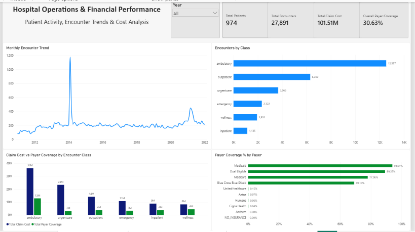
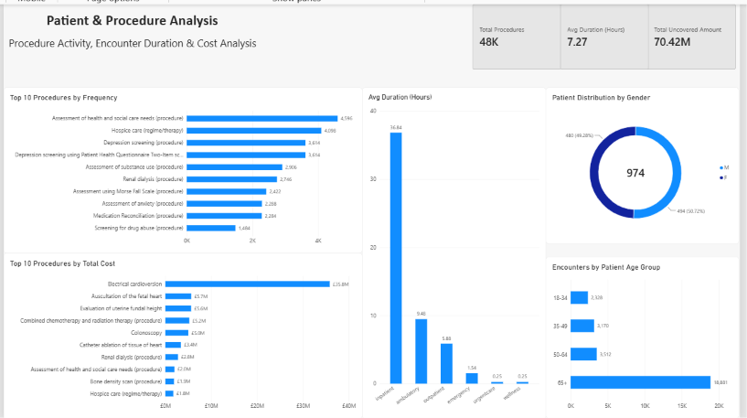
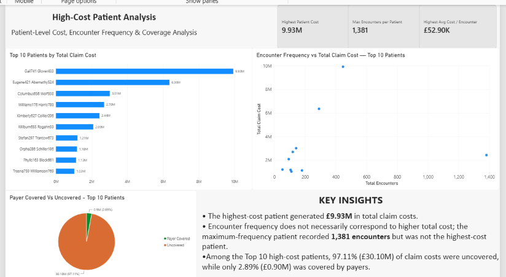

# Hospital Patient Analytics | SQL Server & Power BI

## Project Overview

An end-to-end healthcare analytics project using Microsoft SQL Server and Power BI to analyse hospital patient activity, encounter patterns, procedure utilisation, healthcare costs and insurance payer coverage.

The project demonstrates the complete data analytics workflow, from importing raw CSV files and performing data quality checks to building a relational database, writing analytical SQL queries and developing interactive Power BI dashboards.

**Dataset:** Maven Analytics Hospital Patient Records (synthetic healthcare data).

## Business Objectives

- Analyse hospital encounter volumes and trends over time.
- Identify the most frequent and highest-cost medical procedures.
- Evaluate claim costs, payer coverage and uncovered amounts.
- Understand patient demographics and encounter duration.
- Identify high-cost patients and investigate the relationship between encounter frequency and financial impact.

## Tools and Technologies

- **SQL Server & SSMS:** Data cleaning, transformation, validation and analysis.
- **SQL:** Joins, aggregations, CASE expressions, subqueries, date calculations and ranking.
- **Power BI:** Interactive dashboards and data visualisation.
- **Power Query:** Data preparation and transformation.
- **DAX:** KPI measures, financial calculations, time-based analysis and patient segmentation.
- **GitHub:** Project documentation and version control.

## Dataset and Data Model

The dataset contains five main entities:

| Table | Records | Description |
|---|---:|---|
| Patients | 974 | Patient demographic information |
| Encounters | 27,891 | Hospital visits and associated claim costs |
| Procedures | 47,701 | Medical procedures and their costs |
| Payers | 10 | Insurance payer information |
| Organizations | 1 | Healthcare organisation information |

A relational model connects patients, encounters, procedures, payers and healthcare organisations using primary and foreign keys.

## Data Cleaning and Validation

1. Imported the five source CSV files into SQL Server staging tables.
2. Created clean tables with appropriate data types and primary keys.
3. Converted date fields and standardised structured data.
4. Checked for duplicate encounter IDs and invalid values.
5. Validated patient and encounter relationships using joins.
6. Applied foreign-key relationships to maintain referential integrity.
7. Verified final record counts before analysis.

## SQL Analysis

The SQL analysis covers:

- Encounter volume and percentage distribution by encounter class.
- Total and average claim costs.
- Payer coverage percentages by encounter class and payer.
- Percentage of encounters with zero payer coverage.
- Most frequent and highest-cost procedures.
- Average encounter duration.
- Top 10 high-cost patients, including encounter frequency, average cost and uncovered amount.

[View SQL scripts](SQL/)

## Power BI Dashboards

### 1. Hospital Operations & Financial Performance

Overview of patient activity, encounter trends, claim costs and payer coverage.



### 2. Patient & Procedure Analysis

Analysis of procedure frequency, procedure costs, encounter duration and patient demographics.



### 3. High-Cost Patient Analysis

Identification of high-cost patients, analysis of encounter frequency versus claim cost, and payer-covered versus uncovered amounts.



[Download the Power BI report](PowerBI/Hospital_Patient_Analytics.pbix)

## Key Findings

- **27,891 hospital encounters** were recorded across 974 patients.
- Ambulatory encounters accounted for **44.95%** of all encounters.
- Total claim costs reached **101.51 million**, with overall payer coverage of **30.63%**.
- Uncovered claim costs totalled approximately **70.42 million**.
- Electrical cardioversion was the highest-cost procedure category, totalling approximately **35.82 million**.
- The highest-cost patient generated approximately **9.93 million** in claim costs.
- Higher encounter frequency did not necessarily correspond to higher total patient costs.
- Among the top 10 highest-cost patients, **97.11%** of claim costs were uncovered.

## Project Structure

```text
Hospital-Patient-Analytics/
|
|-- SQL/
|   |-- 01_database_setup.sql
|   |-- 02_data_cleaning.sql
|   |-- 03_data_quality_checks.sql
|   |-- 04_analysis.sql
|   |-- README.md
|
|-- PowerBI/
|   |-- Hospital_Patient_Analytics.pbix
|   |-- Screenshots/
|       |-- 01_Hospital_Overview.png
|       |-- 02_Patient_Procedure_Analysis.png
|       |-- 03_High_Cost_Patient_Analysis.png
|       |-- README.md
|   |-- README.md
|
|-- README.md
```

## How to Reproduce the Project

1. Download the original Hospital Patient Records dataset from Maven Analytics.
2. Run `SQL/01_database_setup.sql` to create the database and clean table structures.
3. Import the five CSV files into their corresponding `_raw` tables using the SSMS Import Flat File Wizard.
4. Run `SQL/02_data_cleaning.sql` to populate the clean relational tables.
5. Run `SQL/03_data_quality_checks.sql` to validate the data.
6. Run `SQL/04_analysis.sql` to reproduce the SQL analysis.
7. Open the Power BI report in a compatible Power BI Desktop version. Adjust the SQL Server connection settings if required.

## Data Disclaimer

This project uses synthetic healthcare records for educational and portfolio purposes. Patient information and financial results are fictional and should not be interpreted as actual hospital performance or real-world healthcare outcomes.
